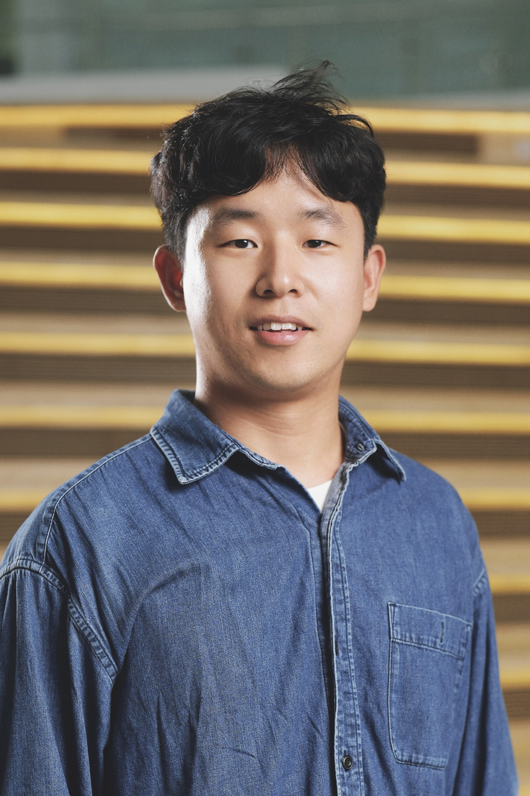

Welcome! 

I am a postdoc at the [Tsung-Dao Lee Institute of Shanghai Jiao Tong University](https://tdli.sjtu.edu.cn/EN/). I am interested in **theoretical cosmology and astroparticle physics**, focusing on some of the most captivating and complex challenges in fundamental physics, such as dark matter, ultralight particles and fields, astrophysical compact objects, complex systems and nonlinear dynamics, etc.

While these topics drive my academic passion, I am also excited about the broader realms of physics (e.g., condensed matter, statistical physics, information science) and interdisciplinary collaborations. Apart from the role as a physicist, I am also an [amateur pianist](personal.md). If you have intriguing ideas or projects that intersect with my interests, I would be thrilled to engage in a discussion!

### Contact
- Email: <hongyi18@sjtu.edu.cn>
- Office: N623, Tsung-Dao Lee Institute
- Address: 1 Lisuo Road, Pudong New Area, Shanghai 201210

### Professional appointments & Education
- 2024-04-present, Postdoc, [Tsung-Dao Lee Institute, Shanghai Jiao Tong University](https://tdli.sjtu.edu.cn/EN). Advisor: [Luca Visinelli](https://lucavisinelli.com/) and [Dong Lai](https://donglai6.github.io/).
- 2018.08-2023.12, PhD in physics, [Department of Physics and Astronomy, Rice University](https://physics.rice.edu/). Advisor: [Mustafa A. Amin](http://mustafa-amin.com/) (main) and [Andrew J. Long](http://al72.blogs.rice.edu/).
- 2014.09-2018.06, BS in physics, [School of Physics, Nanjing University](https://physics.nju.edu.cn/).