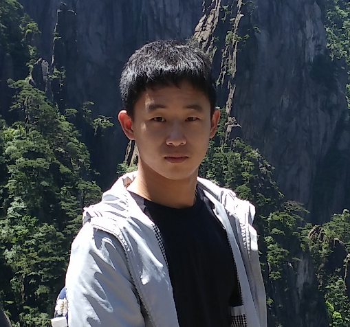



[About me](index.md) &nbsp;&nbsp;&nbsp;&nbsp; [Research](research.md) &nbsp;&nbsp;&nbsp;&nbsp; [Talks](talks.md) &nbsp;&nbsp;&nbsp;&nbsp; [Teaching](teaching.md) &nbsp;&nbsp;&nbsp;&nbsp; [Music](music.md)

------

I'm a PhD candidate in cosmology at [Rice University](https://www.rice.edu/). My original name is 张闳一. Look at my [CV](file/CV.pdf).

### Research interests

- Dynamics of nontopological solitons.
- Theory of early universe, e.g. inflation and reheating.
- Theory of dark matter and dark energy.
- Nonlinear dynamics and chaos.

### Contact

- Email: hongyi@rice.edu
- Office: 306 in Herman Brown Hall
- Mailing: Rice University Herman Brown Hall – MS 108, 6100 Main St, Houston, TX 77005

### Education & Experiences

- 2018.08-Present, PhD, [Department of Physics & Astronomy, Rice University](https://physics.rice.edu/). Advisor: [Mustafa A. Amin](http://mustafa-amin.com/).

- 2017.08-2017.10, Summer Undergraduate Research Fellowship, The Hong Kong University of Science and Technology.

- 2016.07, Summer Undergraduate Research Fellowship, The Institute of High Energy Physics of the Chinese Academy of Sciences.

- 2014.09-2018.06, BS, [School of Physics, Nanjing University](https://physics.nju.edu.cn/). Thesis advisor: [Yeuk-Kwan Edna Cheung](https://physics.nju.edu.cn//ry/qymc/jxky/20190904/i18681.html).
