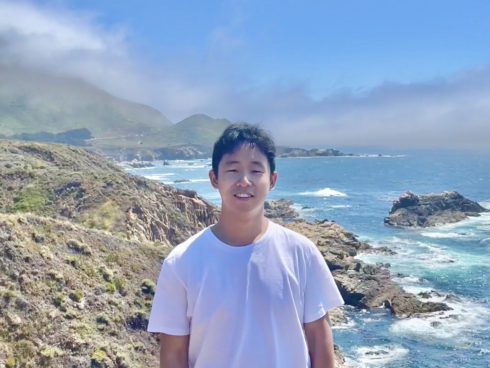

Welcome! 

I am a PhD candidate at [Rice University](https://www.rice.edu/) in Houston, Texas, specializing in **theoretical cosmology, astrophysics and particle physics**. My research focuses on tackling some of the most captivating and complex challenges in fundamental physics, including ultralight dark matter, axions and axionlike particles, neutron stars and other compact objects, effective field theroy, structure formation, nontopological solitons, modified gravity and numerical relativity.

While these topics drive my academic passion, I am equally drawn to the broader realms of physics, mathematics, computer science, etc. I thrive on **interdisciplinary collaborations**, seeking innovative ways to apply my knowledge across disciplines and bring theoretical insights into practical experiments. If you have intriguing ideas or projects that intersect with my interests, I would be thrilled to engage in a discussion!

  

In addition to my research endeavors, I hold a deep passion for [music](personal.md). I embarked on my piano journey at the age of 7. Notably, I had the privilege of collaborating with the talented soprano Xia Liu in a [New Year recital](/personal/2023-01-08-the-plum-blossom-on-snow.md) in Cologne, Germany, and the violinist Xiaohua Sheng in a violin concert in Nanjing, China. During my undergraduate years at [Nanjing University](https://www.nju.edu.cn/), I performed in over 10 concerts of piano, violin and chamber music. If you too share a passion for music, please feel free to reach out; I'd love to chat and share my favorite compositions with you!

### Contact

- Email: <hongyi@rice.edu>
- Office: 306 in Herman Brown Hall
- Mailing: Rice University Herman Brown Hall – MS 108, 6100 Main St, Houston, TX 77005

### Education

- 2018.08-Present, PhD, [Department of Physics & Astronomy, Rice University](https://physics.rice.edu/). Advisor: [Mustafa A. Amin](http://mustafa-amin.com/). My advisory committee also includes [Andrew J. Long](http://al72.blogs.rice.edu/).

- 2014.09-2018.06, BS, [School of Physics, Nanjing University](https://physics.nju.edu.cn/). Thesis advisor: [Yeuk-Kwan Edna Cheung](https://inspirehep.net/authors/1022068?ui-citation-summary=true).