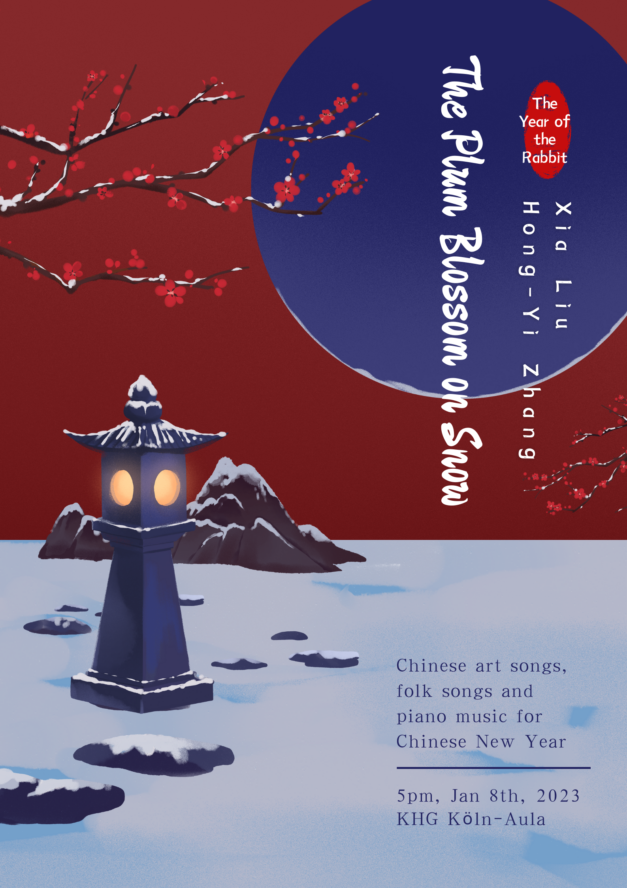

<figure>
  

    
  

</figure>

Soprano: Xia Liu

Pianist: Hong-Yi Zhang

5pm, Jan 8th, 2023

KHG Köln–Aula

### Concert program

1. Huang Zi - Over the Snow for Plum Blossoms
   
   黄自 - 踏雪寻梅

2. Huang Zi - The Flower or the Haze
   
   黄自 - 花非花 

3. Huang Zi - Missing Home
   
   黄自 - 思乡

4. Huang Zi - Longing for the Beloved in Spring
   
   黄自 - 春思曲 

5. Zhao Yuanren - Listening to Rain
   
   赵元任 - 听雨

6. Deng Yuxian - Spring Wind
   
   邓雨贤作曲，萧泰然改编 - 望春风

7. Ran Tianhao - Joy of Snowflakes
   
   冉天豪 - 雪花的快乐

8. Liu Qing - Song of the Yue Boatman
   
   刘青 – 越人歌 楚辞

9. Chinese Guqin Music - Parting Tune at the Yangguan Pass
   
   古琴曲 - 阳关三叠

10. Guangdong Folk Song - Colorful Clouds Chasing the Moon
    
    广东民歌，王建中改编 - 彩云追月

11. Xinjiang Uygur Folk Song – A Glass of Wine
    
    维吾尔族民歌 - 一杯美酒

12. Xinjiang Tatar Folk Song – In the Silver Moonlight
    
    塔塔尔族民歌 - 在那银色的月光下

13. Xinjiang Kazak Folk Song – Mayila
    
    哈萨克族民歌 – 玛依拉

14. Zhu Jian’er - Days of Emancipation
    
    朱践耳作曲，储望华改编 - 翻身的日子

15. Jiangsu Folk Song – Jasmine Flower
    
    江苏民歌 – 茉莉花

16. Sichuan Folk Song – When Will the Locust Tree Bloom
    
    四川民歌 – 槐花几时开

17. Huang Youyi - Back from the Fair
    
    黄有异 - 赶圩归来阿哩哩（彝族民歌）

### d