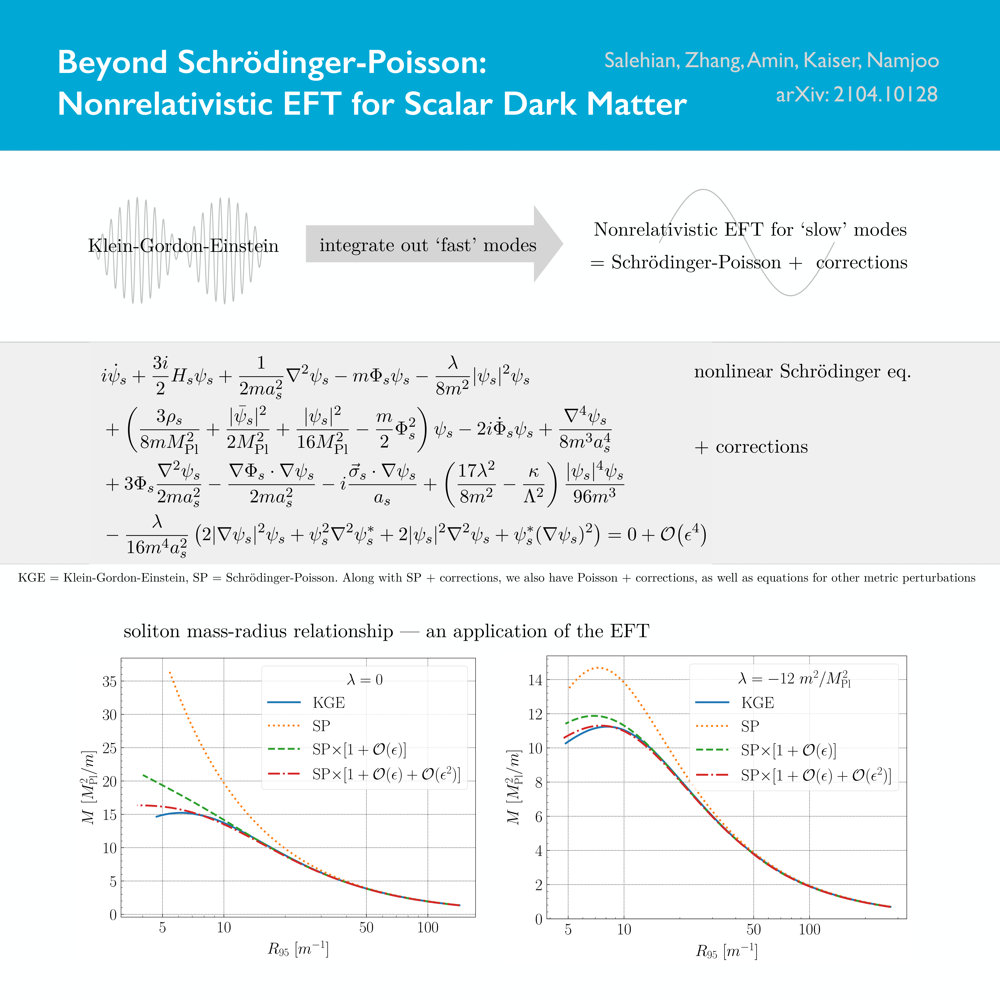
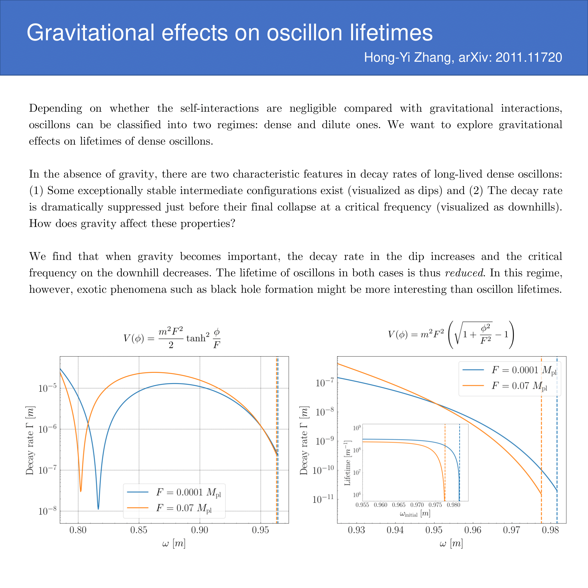
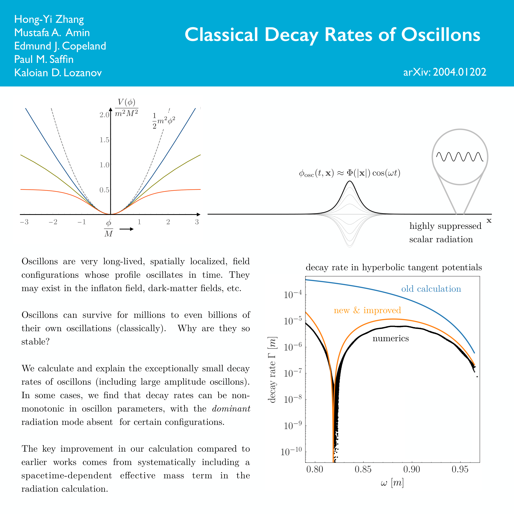

**My publications:** [Inspire](https://inspirehep.net/authors/1790638?ui-citation-summary=true)

**My research note**

- [Foundations of cosmology](research/cosmology.md)
- [Numerics](research/numerics.md)

### Dynamics of non-topological solitons

Non-topological solitons in cosmology are spatially-localized and time-periodic field configurations. They play important roles in many contexts of cosmology research with various names. These exotic celestial objects in certain cases mimic neutron stars and even black holes, and can have profound influences on future astronomy observations. Examples include Q-balls, oscillons, oscillatons, axion stars. They have great impacts in both the early universe, e.g. reheating and cosmological phase transitions, and the late universe, e.g. dark matter and structure formation.

### Axion-like dark matter

Axions are well-motivated particles to solve the strong CP problem. Moreover, the string theory motivates a number of pseudoscalar particles similar with axions. These together provide a large parameter space for axion-like dark matter. If the Peccei-Quinn symmetry is broken after the inflation, the axionic dark matter distribution is expected to be highly inhomogeneous, leading to the formation of axion miniclusters and axion stars (oscillons). It is probable that a great amount of axion-like dark matter is in the form of oscillons and thus produces exotic observational signatures.

### One-page summary of some of my publications

Pictures are listed in reversed chronological order. To zoom in the picture, just right click and open it in a new tab.

test
|  |  |  |